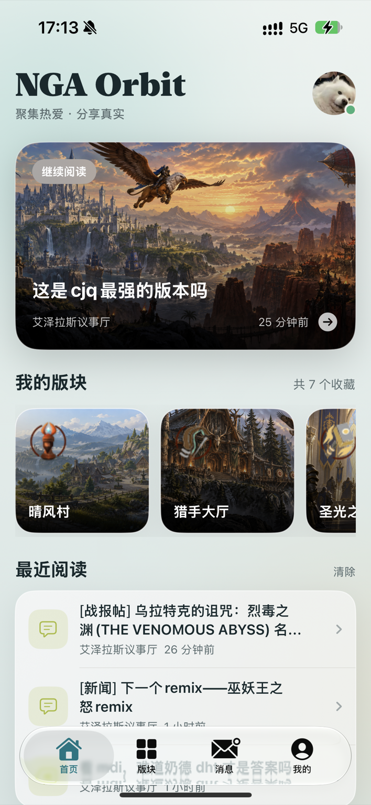
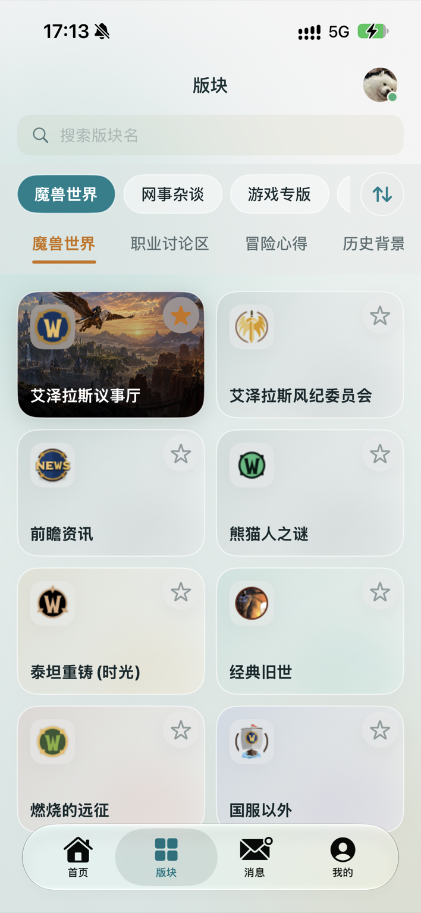
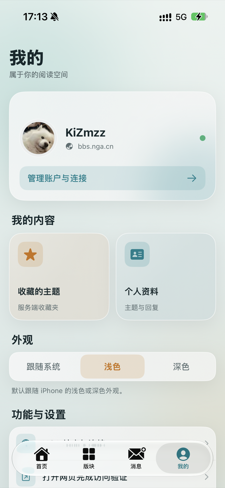

# NGA Orbit

一款为 iOS 打造的现代 NGA 非官方客户端，专注舒适阅读、原生交互与流畅体验。

Swift 6 / SwiftUI，最低 iOS 17。网络和内容解析是独立 Swift Package `NGAKit`，无第三方运行依赖，无中转服务器。

> NGA Orbit 是社区开发的非官方项目，与 NGA 官方无隶属或背书关系。

## 界面预览

<p align="center">
  
  
  
  
</p>

## 打开与运行

打开 `NGAReader.xcodeproj`，选择 `NGAReader` scheme 和连接的 iPhone。在 Signing & Capabilities 中选择自己的开发团队。当前机器使用 `/Applications/Xcode-beta.app`；脚本通过 `DEVELOPER_DIR` 选择工具链，不修改系统默认 Xcode。

```sh
DEVELOPER_DIR=/Applications/Xcode-beta.app/Contents/Developer \
  xcodebuild -project NGAReader.xcodeproj -scheme NGAReader \
  -destination 'generic/platform=iOS' -derivedDataPath build \
  CODE_SIGNING_ALLOWED=NO build

DEVELOPER_DIR=/Applications/Xcode-beta.app/Contents/Developer swift test
DEVELOPER_DIR=/Applications/Xcode-beta.app/Contents/Developer swift run nga-probe board 414
DEVELOPER_DIR=/Applications/Xcode-beta.app/Contents/Developer swift run nga-probe topic 6406100
```

`python3 scripts/generate_project.py` 可重新生成 Xcode 工程。首次运行前，请在 Xcode 的 Signing & Capabilities 中选择自己的开发团队；命令行构建也可传入 `DEVELOPMENT_TEAM`。

## 手机上使用

1. 打开 NGA Orbit。启动时发起原生联网请求；如 iOS 弹出联网授权提示，请允许联网。若此前已拒绝，App 会提示前往系统设置。然后点击「连接 NGA」。
2. 选择「打开网页完成访问验证」，按 NGA 网站提示操作；需要账号权限时点「登录 NGA 账号」。
3. 在网页右上角点「完成」，回到原生页面。访客会话与登录会话分别显示；检测到 Cookie 不代表服务端已接受。
4. 进入“版块”，在具体版面卡片上点星标收藏；收藏项会自动出现在首页，再点实心星标可取消。
5. 点击主题进入阅读；底部上一页、下一页翻页。失败时显示错误与重试，不会切换到假数据。

## 更新记录

### 2026-09-15

- 修复退出登录后首页仍显示上一段会话数据的问题。现在退出时会同步清除 Cookie、钥匙串会话、本地阅读历史和收藏版块，并立即刷新首页与版块页。
- 将退出操作文案调整为「退出登录并清除本地数据」，明确本地个人数据也会一并移除。
- 修复真机启动动画背景未覆盖 Home Indicator 安全区、屏幕底部出现空白的问题。
- 已在 iPhone 16 上完成签名构建、覆盖安装与启动验证。

## 开发进度

### ✅ 已完成
- **应用架构**：底部 4 tab（首页 / 版块 / 消息 / 我的）；深海蓝 / 浅色纸张两套阅读外观，默认跟随系统，也可在「我的 → 外观」手动选择；进入内容后隐藏底栏。
- **首页**：连接状态卡、我的版面（仅展示从目录收藏的真实具体版面）、账户入口；不提供数字 ID 手动添加，避免把目录分组误作可读取版面。
- **版块（社区目录）**：可拖动排序并本地保存的一级分类导航；魔兽世界等大版块使用第二层分组导航（魔兽世界 / 职业讨论区 / 冒险心得 / 历史背景 资料整理）；具体版面采用两列卡片并显示真实图标，支持搜索。
- **版块 → 主题列表**：版块身份卡与真实简介、分段筛选（全部 / 置顶 / 精华 / 热帖）、置顶优先、相对时间、顶 / 精标、**收藏版块**、由顶部按钮展开的板内搜索。
- **阅读器**：编辑式阅读布局（真实用户头像 + 作者 + 楼主/楼层 + 时间 + 正文）、楼层从 `#0` 开始、引用元数据清理并原生显示、单楼操作、底部「回复本帖」+ 上一页 / 下一页；当 NGA 截断个别主题的 JSON 数据时，从完整 HTML 提取内容并继续原生渲染，不使用网页阅读页。
- **用户资料**：帖子内点击真实头像或用户名进入原生用户页；资料来自 NGA 用户接口，提供主题、回复、公开收藏和签名四段，并接入关注/取关、发起私信及私信黑名单操作。缺失或非公开字段不推测、不补造。
- **BBCode**：支持正文、图片、表格、分隔线、左右对齐、折叠、引用、列表、代码、站内链接、媒体链接、骰子与常用表情；连续文字、嵌套样式、链接和表情使用同一行内富文本排版，表格在手机上横向滚动并统一同一行的高度。
- **消息**：互动 / 私信 / 系统 三段；`noti` / `message` 抓取 + 加载 / 空 / 错误三态。
- **我的**：会话状态、网页验证 / 登录 NGA 账号、退出登录并清除本地数据、关于。
- **写操作**：回复、收藏主题、收藏楼、引用（UI + 底层请求）；回复编辑器可对选中文字插入格式语法，并可在“源码 / 预览”之间切换。
- 版块索引（`bbs_index_data.js`，GB18030）解析：递归取全量版块、真实名字 / fid、分类稳定排序、搜索防闪退。
- 签名团队固化在生成器；真机版块图标 / 用户头像取用。

### 🔧 开发中 / 待真机校准
- **私信**：列表 / 详情已按 MNGA 对齐为 POST + `__output=8`，并自动附带 `access_uid` / `access_token`（来自 `ngaPassportUid` / `ngaPassportCid`）。仍需**账号登录**（游客会话被拒）；待真机实测确认列表能刷出会话。
- **热帖 / 收藏版块 / 板内搜索**：接口已按文档实现，**字段待真机实测校准**。
- **主题缩略图**：优先使用 NGA 返回的封面字段；否则逐一检查当前页主题的楼主正文。确认有图且图片成功加载才显示，没图或失效图片不保留占位框。
- **写操作（回复 / 收藏 / 引用）**：已实现，待账号登录后实测校验参数。

### ⬜ 未开发
- 私信会话详情 / 发起私信、点击提醒跳转。
- 消息项 / 发送者头像。
- 账号信息（等级 / 声望 / 徽章）、设置（外观 / 阅读偏好 / 缓存）。
- 完整 BBCode（视频 / 附件 / 引用楼跳转）、发帖、表情全量映射、收藏同步（服务端）。
- 离线缓存、动态版块目录。

## 产品功能说明

模块化的产品功能规格见 [docs/DESIGN.md](docs/DESIGN.md)（仅功能，不含 UI/排版规定）。

## 验证边界

截至 2026-09-07，Xcode 27 Beta 的 iOS 构建、签名构建、iPhone 16 安装启动已完成。主题列表和帖子详情已在真机完成视觉检查；`read.php` 会优先请求 UTF-8 输出，遇到 NGA 个别主题的格式异常时自动以 GB18030 输出重试，再以完整 HTML 的原生解析为最后兼容路径。已用真实主题 `tid=23437206`（NGA 论坛代码大全）验证该路径可在手机上显示。匿名实际请求返回 NGA 403 /「访客不能直接访问」，已确认错误提示流程；账号登录后的列表、详情、图片链路以及写操作仍需在手机完成网站会话后核验。

测试中的 JSON / BBCode 是专门构造的兼容性样本，不是实时论坛内容。

详细资料、请求参数和实测结果见 [docs/API-VERIFICATION.md](docs/API-VERIFICATION.md)。

BBCode 的显示范围、编辑器语法和移动端处理原则见 [docs/BBCODE.md](docs/BBCODE.md)。
